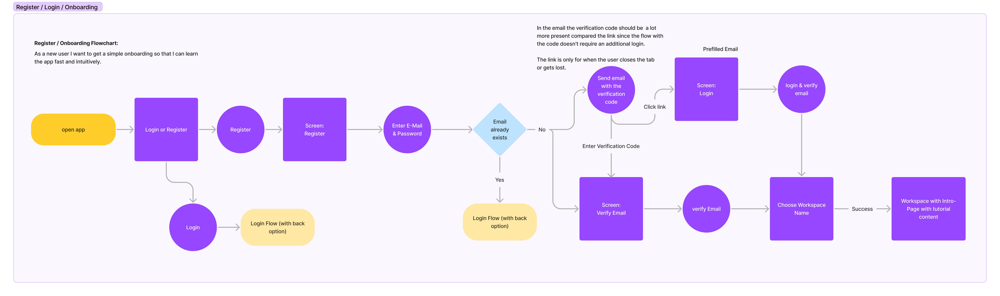

# Registration Process


Note: best to open in a separate tab

## Design goals

- The user should be able to register with a username and password.
- During the process a main device, device and a userChain should be created and attached to the user. No man in the middle attack should be possible resulting in a different main device or user chain or one of these being attached to a wrong sessionKey.
- In case the user signs up from a workspace invitation page, the user should be automatically added to the workspace without the server or a man in the middle being able to change the workspace the user is added to.

## Cryptographic Dependencies and actual implementation

- opaque_registration: OPAQUE registration flow
- kdf: `sodium.crypto_kdf_derive_from_key(crypto_aead_xchacha20poly1305_ietf_KEYBYTES, subkeyId, context, key)`
- noncegen: `sodium.randombytes_buf(sodium.crypto_secretbox_NONCEBYTES)`
- signingKeyPairGen: `sodium.crypto_sign_keypair()`
- encryptionKeyPairGen: `sodium.crypto_box_keypair()`
- sign: `sodium.crypto_sign_detached(message, privateKey)`
- encrypt: `sodium.crypto_secretbox_easy(message, nonce, key)`
- createUserChain: see user-chain

## Steps without workspace invitation

```ts
exportKey = opaque_registration();
encryptionKey = kdf(1111, "m_device", exportKey);
nonce = noncegen();
// create device
deviceSigningKeyPair = signingKeyPairGen();
deviceEncryptionKeyPair = encryptionKeyPairGen();
deviceEncryptionPublicKeySignature = sign(
  "user_device_encryption_public_key" + deviceEncryptionKeyPair.publicKey,
  deviceSigningKeyPair.privateKey
);
ciphertext = encrypt(
  {
    signingPublicKey,
    signingPrivateKey,
    encryptionPublicKey,
    encryptionPrivateKey,
    encryptionPublicKeySignature,
    createdAt,
  },
  nonce,
  encryptionKey
);
```

The following information is sent to the server:

```ts
{
  registrationRecord, // OPAQUE registration record
  encryptedMainDevice: {
    ciphertext,
    nonce,
  },
  serializedUserChainEvent,
}
```

https://github.com/serenity-kit/Serenity/blob/main/apps/app/components/register/RegisterForm.tsx#L85-L193

https://github.com/serenity-kit/Serenity/blob/main/packages/common/src/createAndEncryptMainDevice/createAndEncryptMainDevice.ts

The server stores this information in the database in the `UnverifiedUser` table and triggers an email with a verification code.

On the client side the `username`, `password` and `createChainEvent` are stored in memory.

https://github.com/serenity-kit/Serenity/blob/main/apps/app/components/register/RegisterForm.tsx#L169-L176

https://github.com/serenity-kit/Serenity/blob/main/apps/app/utils/authentication/registrationMemoryStore.ts

After that client is redirecting to the registration verification page.

https://github.com/serenity-kit/Serenity/blob/main/apps/app/navigation/screens/registrationVerificationScreen/RegistrationVerificationScreen.tsx

From here on there are two different paths depending on if the user:

1. Enters the code into the current session (with the `username`, `password` and `createChainEvent` stored in memory)
2. Open the link from the email directly.

### Flow 1

The user enters the verification code and submits the form. The server checks the code and if it is valid, it creates a new `User` record in the database and the user finished the registration process. The `verifyRegistration` mutation only requires the username and the verification code. There are some concerns if this could be abused, but no valid use-case was found so far.

https://github.com/serenity-kit/Serenity/blob/main/apps/app/navigation/screens/registrationVerificationScreen/RegistrationVerificationScreen.tsx#L175-L180

After that the client is automatically logged in based on the `username` and `password` stored in memory.

https://github.com/serenity-kit/Serenity/blob/main/apps/app/navigation/screens/registrationVerificationScreen/RegistrationVerificationScreen.tsx#L198C15-L198C46

https://github.com/serenity-kit/Serenity/blob/main/apps/app/navigation/screens/registrationVerificationScreen/RegistrationVerificationScreen.tsx#L121-L166

The user is done in this case and redirected to onboarding.

### Flow 2

In case the user open the email link the username and verification code are part of the query parameters and the user lands on the RegistrationVerificationScreen. The `verifyRegistration` mutation can be triggered and since on the server only the username and the verification code are required this can be done without being logged in. There are some concerns if this could be abused, but no valid use-case was found so far.

https://github.com/serenity-kit/Serenity/blob/main/apps/backend/src/database/authentication/finalizeRegistration.ts#L123-L134

The user is sent to the login page where the password from before has to be entered. This triggeres the login process as described in the user authentication section in the documentation.

## Password Complexity

In order to secure the `exportKey` from being brute-forced a certain level of password complexity is checked upon registration. The [https://github.com/zxcvbn-ts/zxcvbn](https://github.com/zxcvbn-ts/zxcvbn) project is used to determine the complexity. It is based on [Dropox's zxcvbn](https://github.com/dropbox/zxcvbn), written in Typescript, actively maintained and used by other projects e.g. [Clerk](https://clerk.com/docs/security/password-protection#password-strength).

Configuration: https://github.com/serenity-kit/Serenity/blob/main/apps/app/components/register/RegisterForm.tsx#L33-L42
Evaluation: https://github.com/serenity-kit/Serenity/blob/main/apps/app/components/register/RegisterForm.tsx#L265

The highest score (4 - very unguessable: strong protection from offline slow-hash scenario. (guesses >= 10^10)) must be reached before a user can register: https://github.com/serenity-kit/Serenity/blob/main/apps/app/components/register/RegisterForm.tsx#L102-L106

### Why is this important?

With a weak password a compromised server could brute-force the `exportKey` and decrypt the user's data. This would break the end-to-end encryption.

Brute-forcing would work by running the OPAQUE login flow again and again using a different password. An attacker would need the registration record and the opaque serverSetup containing the OPRF seed and server private key.

## Opaque Server Public Key Verification

In order to make sure the user is talking to the correct opaque server the server's public key is verified.

https://github.com/serenity-kit/Serenity/blob/main/apps/app/components/register/RegisterForm.tsx#L129-L131

https://github.com/serenity-kit/Serenity/blob/main/apps/app/utils/getOpaqueServerPublicKey/getOpaqueServerPublicKey.ts
