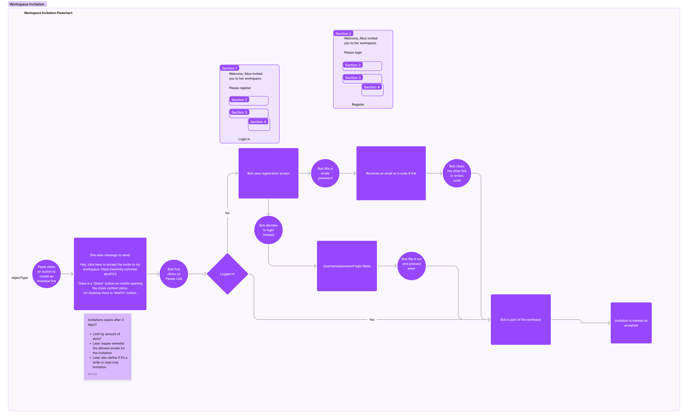

# Workspace Invitation

A user can only join a workspace through a workspace invitation link. The invitation link is generated by a workspace admin and has to be sent to the invitee out-of-band. The invitee can then use the link to join the workspace.

Once the invitee clicks on the link, they can decide to ignore or accept the invitation. If they accept the invitation, they will be addded to the workspace as non-authorized user.

Any other user can authorize them, which is happening automatically and once the invitee is authorized, they get access to the workspace.


Note: best to open in a separate tab

## Design goals

The goal was to provide a way to add users to a workspace that

1. follows a familiar flow in modern SaaS apps
2. allows to establish a secure trust relationship between the invitee and the existing workspace members without the server infrustructure ever beeing able to access invitees private data

Invitation link sharing has become a popular invitation method e.g. Slack, Figma and therefor was chosen as the way to invite users to a workspace.

In order to establish a secure trust relationship the invitation link contains a secret that is only known to the invitee and the inviter.

### References

- https://book.keybase.io/docs/teams/seitan
- https://github.com/local-first-web/auth

## Cryptographic Dependencies and actual implementation

- randomInt: `sodium.randombytes_uniform(2 ** 31 - 1)` // in JS a larger upper bound doesn't seem possible, see https://github.com/serenity-kit/Serenity/blob/main/packages/common/src/kdfDeriveFromKey/kdfDeriveFromKey.ts#L16
- kdf: `sodium.crypto_kdf_derive_from_key(crypto_aead_xchacha20poly1305_ietf_KEYBYTES, subkeyId, context, key)`
- generateNonce: `sodium.randombytes_buf(sodium.crypto_aead_xchacha20poly1305_ietf_NPUBBYTES)`
- encryptAead: `sodium.crypto_aead_xchacha20poly1305_ietf_encrypt(message, additionalData, nonce, key)`
- decryptAead: `sodium.crypto_aead_xchacha20poly1305_ietf_decrypt(ciphertext, additionalData, nonce, key)`

Note: For `encryptAead` every message is prefixed with a block of four 0-bytes to ensure commitment. [More info here](https://github.com/serenity-kit/secsync/blob/main/packages/secsync/src/crypto/encryptAead.ts#L16-L20)

## Invitation Link Structure

`/accept-workspace-invitation/${invitationID}#key={invitationSigningKeyPairSeed}`

Example: `https://www.serenity.li/accept-workspace-invitation/_BO60g6BZdRjpcuu18YjfQeUUcLKrRrV#key=mTxABax3E6d0smXmIg6DotdwKlRYrCsoLyzWojgRx3Q`

The invitation key is located in the HASH part of the URL. This is important because the hash part of the URL is never sent to the server. The server only sees the path part of the URL.

## Creating a Workspace Invitation

The flow is described in [Workspace Chain: Add Invitation](./workspace-chain#add-invitation). The returned `invitationSigningKeyPairSeed` is used in the URL.

The default expiration-date is 2 days.

https://github.com/serenity-kit/Serenity/blob/main/apps/app/components/workspace/CreateWorkspaceInvitation.tsx#L101-L144

## Accepting a Workspace Invitation

Here we need to differentiate between

- an existing and logged in user
- a existing, but logged out user
- a new user

### Existing User (logged out)

The user logs in using the login form. After this the `mainDevice` is available on the client in memory. The workspace invitation is accepted by creating a acceptInvitation event in the workspaceChain. See [Workspace Chain: Accept Invitation](./workspace-chain#accept-invitation).

https://github.com/serenity-kit/Serenity/blob/main/apps/app/navigation/screens/acceptWorkspaceInvitationScreen/AcceptWorkspaceInvitationScreen.tsx#L250-L262

https://github.com/serenity-kit/Serenity/blob/main/apps/app/navigation/screens/acceptWorkspaceInvitationScreen/AcceptWorkspaceInvitationScreen.tsx#L64-L108

https://github.com/serenity-kit/Serenity/blob/main/apps/app/utils/workspace/acceptWorkspaceInvitation.ts

### Existing User (logged in)

The user clicks on accept and gets presented the verify password modal. Once submitted the client will download and unlock the `mainDevice`. The workspace invitation is accepted by creating a acceptInvitation event in the workspaceChain. See [Workspace Chain: Accept Invitation](./workspace-chain#accept-invitation).

https://github.com/serenity-kit/Serenity/blob/main/apps/app/navigation/screens/acceptWorkspaceInvitationScreen/AcceptWorkspaceInvitationScreen.tsx#L233-L243

https://github.com/serenity-kit/Serenity/blob/main/apps/app/navigation/screens/acceptWorkspaceInvitationScreen/AcceptWorkspaceInvitationScreen.tsx#L64-L108

https://github.com/serenity-kit/Serenity/blob/main/apps/app/utils/workspace/acceptWorkspaceInvitation.ts

### New User

On the invitation page the user gets presented the Registration form.

https://github.com/serenity-kit/Serenity/blob/main/apps/app/navigation/screens/acceptWorkspaceInvitationScreen/AcceptWorkspaceInvitationScreen.tsx#L265-L272

The normale [registration process](./user-registration#steps-without-workspace-invitation) happens with a few differences. After finish creating a `mainDevice` the `invitationSigningKeyPairSeed` is encrypted.

```ts
subkeyId = randomInt();
key = kdf(subkeyId, "wsinvite", exportKey); // the exportKey is 64 bytes long, so only the first 32 bytes are used
nonce = generateNonce();
ciphertext = encryptAead(invitationSigningKeyPairSeed, "", nonce, key);
```

https://github.com/serenity-kit/Serenity/blob/main/apps/app/components/register/RegisterForm.tsx#L119-L135

https://github.com/serenity-kit/Serenity/blob/main/packages/common/src/encryptWorkspaceInvitationKey/encryptWorkspaceInvitationKey.ts

When invoking the `finishRegistration` mutation the following parameters are sent to the server in addition to the normal process:

- `invitationId`
- `subkeyId`
- `nonce`
- `ciphertext`

https://github.com/serenity-kit/Serenity/blob/main/apps/app/components/register/RegisterForm.tsx#L150-L153

Then the client queries for pending workspace invitations, validates them and accepts them. Such a pending workspace invitation can only exist if the user signed up on the workspace invitation page.

After the email verification the client queries for pending workspace invitations, validates them and accepts them. Such a pending workspace invitation can only exist if the user signed up on the workspace invitation page.

```ts
key = kdf(subkeyId, "wsinvite", exportKey);
invitationSigningKeyPairSeed = decryptAead(ciphertext, "", nonce, key);
```

https://github.com/serenity-kit/Serenity/blob/main/apps/app/navigation/screens/registrationVerificationScreen/RegistrationVerificationScreen.tsx#L157

https://github.com/serenity-kit/Serenity/blob/main/apps/app/navigation/screens/registrationVerificationScreen/RegistrationVerificationScreen.tsx#L67-L119

https://github.com/serenity-kit/Serenity/blob/main/packages/common/src/decryptWorkspaceInvitationKey/decryptWorkspaceInvitationKey.ts

https://github.com/serenity-kit/Serenity/blob/main/apps/app/utils/workspace/acceptWorkspaceInvitation.ts

## Workspace Invitation Revocation

Any workspace admin can revoke an invitation at any point by deleting it. The purpose is to make sure any workspace invitation link can be revoked if it is compromised.
